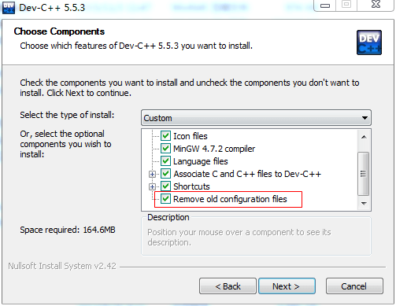

# DEVC++编译奇怪报错问题解决  

> 平时都是在linux下编软件，偶尔才会编两个windows工具程序方便大家使用。所以一直使用轻量级的IDE DEVC++来编译，但有天突然发现以前可以通过DEVC++编译的代码突然就编不过了。报错还很奇怪。  

示例代码如下：  
```c
#include <stdio.h>

#define dprintf(format, argv...) printf("%s(%d):" format, __FUNCTION__, __LINE__, ##argv)

int main(int argc, char const *argv[])
{
    dprintf("test\n");
    return 0;
}

```

编译提示第三行语法错误，`[Error] syntax error in macro parameter list`。可是这明明是很正确的一行代码呀，linux下经常这么写。  

怀疑是之前装过VS2010，导致编译环境改变，用过VS的同学应该都知道，你用标准C库写的代码编译有时有问题，它把一些函数给改了。查了下，是说VS自带的编译器不支持变参宏的定义，gcc编译器支持。卸载了VS2010问题依旧，之后又重装了DEVC++，还是一样。。  

使用以前安装的mingw编译工具编译没有问题，但用DEVC++下的有问题，还是哪儿配置出现了问题。再次卸载DEVC++，再**安装的时候注意了，把`remove old configuration files`勾上**再试就可以了。  
  

---

吐槽：用VS真折腾，首先安装VS卸载VS就有得你等，还是GCC好用，DEVC++就够我用了。上次编译开源goahead2.5的代码也是，想编译个exe应用，但开源代码里面提供的貌似是vs的工程文件，而不是Makefile。手动写了个makefile，发现总是编译不过，因为WIN32宏包起来的代码有的是用VS的一些特有函数写的，会提示未定义。  
