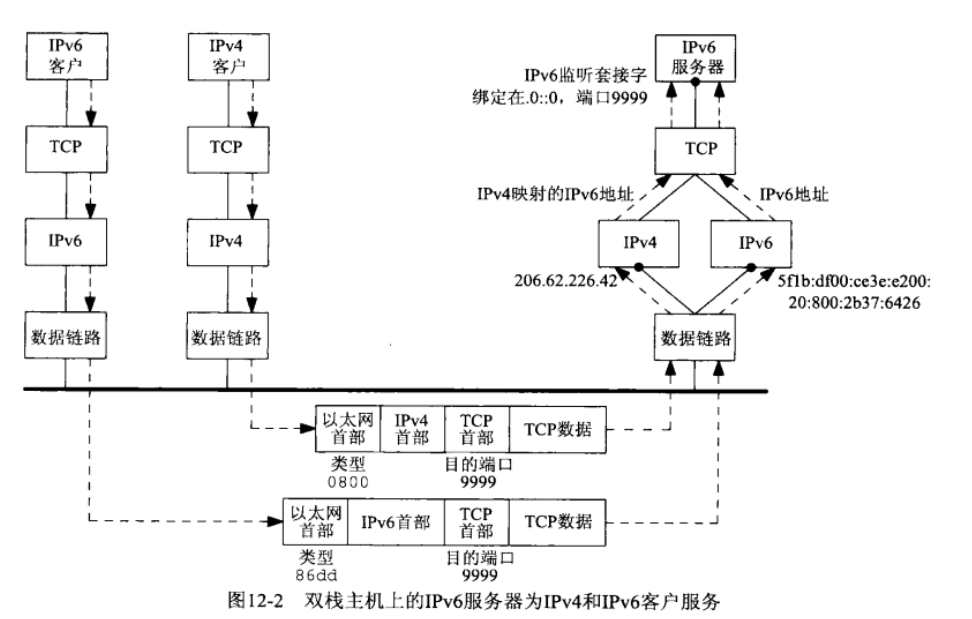

# IPV6 Socket编程  
@(C编程)[c语言编程]  
> IPV6 socket的练习程序，服务器打印客户端的地址，然后回送收到的消息。  

server_v6.c  
```c 
/************************************************************
Copyright (C), 2017, Leon, All Rights Reserved.
FileName: server_v6.c
Description: IPV6网络编程练习
Author: Leon
Version: 1.0
Date: 2017-2-9 11:09:39
Function:
History:
<author>    <time>  <version>   <description>
 Leon
************************************************************/

#include <stdio.h>
#include <stdlib.h>
#include <string.h>
#include <sys/types.h>
#include <sys/socket.h>
#include <netinet/in.h>
#include <unistd.h>

#define BUF_LEN 2048
#define PORT 10023

int main(int argc, char *argv[])
{
    int serv_sock = -1, client_sock = -1;
    socklen_t addr_len = 0;
    struct sockaddr_in6 local_addr = {0}, client_addr = {0};
    char buf[BUF_LEN] = {0};
    int err = -1;

    /* 建立socket */
    serv_sock = socket(PF_INET6, SOCK_STREAM, 0);
    if(-1 == serv_sock)
    {
        perror("socket error: ");
        return -1;
    }

    /* 填充地址结构 */
    local_addr.sin6_family = AF_INET6;
    local_addr.sin6_port = htons(PORT);
    local_addr.sin6_addr = in6addr_any;

    /* 绑定地址 */
    err = bind(serv_sock, (struct sockaddr *)&local_addr, sizeof(struct sockaddr_in6));
    if(-1 == err)
    {
        perror("bind error: ");
        close(serv_sock);
        return -1;
    }

    /* 监听 */
    err = listen(serv_sock, 5);
    if(-1 == err)
    {
        perror("listen error: ");
        close(serv_sock);
        return -1;
    }

    /* 循环等待客户连接请求 */
    while(1)
    {
        memset(&client_addr, 0x0, sizeof(client_addr));
        addr_len = sizeof(struct sockaddr_in6);
        client_sock = accept(serv_sock, (struct sockaddr *)&client_addr, &addr_len);
        if(-1 == client_sock)
        {
            perror("accept error:");
            close(serv_sock);
            return -1;
        }

        /* 转换client地址为字符串并打印 */
        inet_ntop(AF_INET6, &client_addr.sin6_addr, buf, BUF_LEN);
        printf("A clinet connected, ip: %s, port %d\n", buf, ntohs(client_addr.sin6_port));

        /* 接收消息 */
        memset(buf, 0x0, BUF_LEN);
        err = recv(client_sock, buf, BUF_LEN, 0);
        if(err < 0)
        {
            perror("recv error:");
            close(serv_sock);
            close(client_sock);
            return -1;
        }
        printf("recv %d bytes: %s\n", err, buf);

        /* 回送消息 */
        err = send(client_sock, buf, strlen(buf), 0);
        if(err < 0)
        {
            perror("send error:");
            close(serv_sock);
            close(client_sock);
            return -1;
        }

        /* 关闭这个client连接 */
        close(client_sock);
    }
    return 0;
}
```
client_v6.c  
```c 
/************************************************************
Copyright (C), 2017, Leon, All Rights Reserved.
FileName: client_v6.c
Description: IPV6网络编程练习
Author: Leon
Version: 1.0
Date: 2017-2-9 11:09:39
Function:
History:
<author>    <time>  <version>   <description>
 Leon
************************************************************/

// connect时地址长度填错，一直报这个错 connect error:: Invalid argument

#include <stdio.h>
#include <stdlib.h>
#include <string.h>
#include <sys/types.h>
#include <sys/socket.h>
#include <netinet/in.h>
#include <unistd.h>

#define BUF_LEN 2048
#define PORT 10023

int main(int argc, char *argv[])
{
    int sock = -1;
    socklen_t addr_len = 0;
    struct sockaddr_in6 serv_addr = {0};
    char buf[BUF_LEN] = {0};
    int err = -1;

    /* 建立socket */
    sock = socket(AF_INET6, SOCK_STREAM, 0);
    if(-1 == sock)
    {
        perror("socket error: ");
        return -1;
    }

    memset(&serv_addr, 0x0, sizeof(serv_addr));
    /* 填充地址结构 */
    serv_addr.sin6_family = AF_INET6;
    serv_addr.sin6_port = htons(PORT);
    serv_addr.sin6_addr = in6addr_loopback;    /* 连接到环回地址 */

    // 不能connect到链路本地地址
    // inet_pton(AF_INET6, "fe80::20c:29ff:fe8f:c168", &serv_addr.sin6_addr);

    addr_len = sizeof(serv_addr);
    err = connect(sock, (struct sockaddr *)&serv_addr, addr_len);
    if(-1 == err)
    {
        perror("connect error:");
        close(sock);
        return -1;
    }

    /* 发送消息 */
    memset(buf, 0x0, BUF_LEN);
    snprintf(buf, BUF_LEN - 1, "hello server, I'm client\n");
    err = send(sock, buf, strlen(buf), 0);
    if(err < 0)
    {
        perror("send error:");
        close(sock);
        return -1;
    }

    /* 接收消息 */
    memset(buf, 0x0, BUF_LEN);
    err = recv(sock, buf, BUF_LEN, 0);
    if(err < 0)
    {
        perror("recv error:");
        close(sock);
        return -1;
    }
    printf("recv %d bytes: %s\n", err, buf);

    close(sock);

    return 0;
}
```

**运行结果**  
```
root@ubuntu:ipv6_socket# ./server_v6
A clinet connected, ip: ::1, port 56358
recv 25 bytes: hello server, I'm client
A clinet connected, ip: ::ffff:192.168.242.1, port 11111
recv 12 bytes: 123456478764
```
第一个客户端为上面程序实现的客户端，connect的本地环回地址。第二个客户端为一个IPV4的客户端，connect的192.168.242.2的地址。可以看到对于支持双栈的**IPV6服务器，一样可以接受IPV4客户端的连接和通信**，IPV4客户端打印出来的地址为IPV4映射的IPV6地址，这些都由协议栈处理好了。附一张图：  
  


**注意点**
* 客户端connect时不能连接到链路本地地址（fe80开头那个地址），否则会报`connect error:: Invalid argument`的错误，可以connect环回地址，或者用命令`ip addr add 2001::1/64 dev eth0`为接口添加一个IPV6地址。connect的地址长度入参错了，也会报这个错