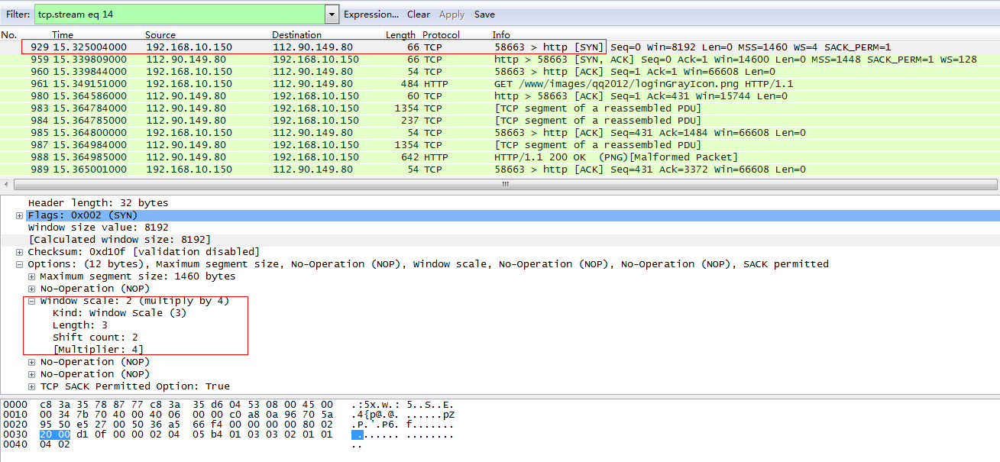
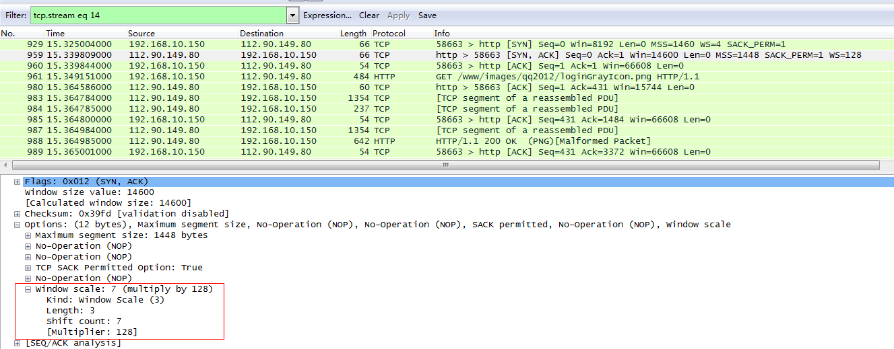
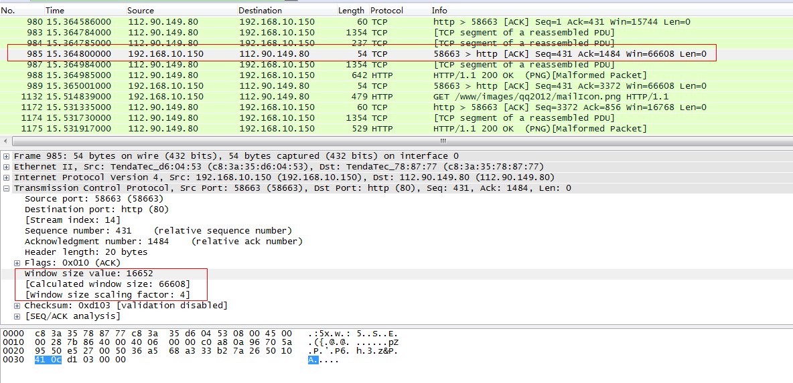
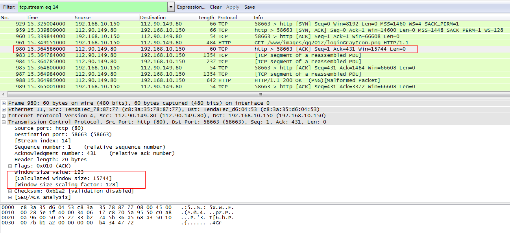

### TCP窗口扩大选项  

　　窗口扩大选项使TCP的窗口定义从16bit可以增加到32bit，这是通过修改TCP的选项来完成的。这个选项只能出现在syn报文中，因此当连接建立后，窗口的亏大因子是固定的。为了使用窗口扩大，两端必须在它们的SYN报文段中发送这个选项。主动连接的一方在其SYN报文中发送这个选项，但是被动连接的一方只能在收到这个选项的SYN时才可以发送这个选项，两个发送的扩大因子可以不同。  
　　*下面是报文*  
　　  
　　主动连接的一方加上了窗口扩大选项，扩大因子为移位2位，即乘积因子为4  
　　  
　　被动连接的一方也发送了窗口扩大选项，扩大为移位7位，即乘积因子为128    
　　  
　　主动连接方回复的ACK使用的窗口扩大乘积因子为4，16652\*4=66608  
　　  
　　被动连接方回复的ACK使用的窗口扩大乘积因子为128，123\*128=15744  
  
　　TCP根据接收缓存的大小自动选择移位位数。这个大小是有系统设置的，但是通常向应用程序提供了修改途径。  
