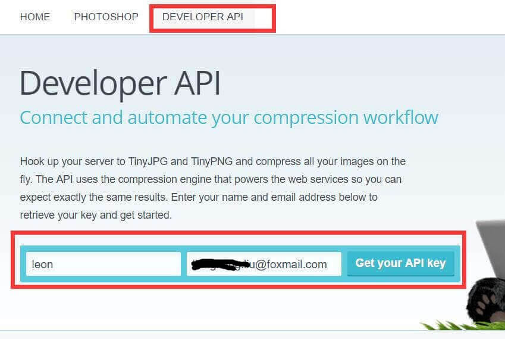
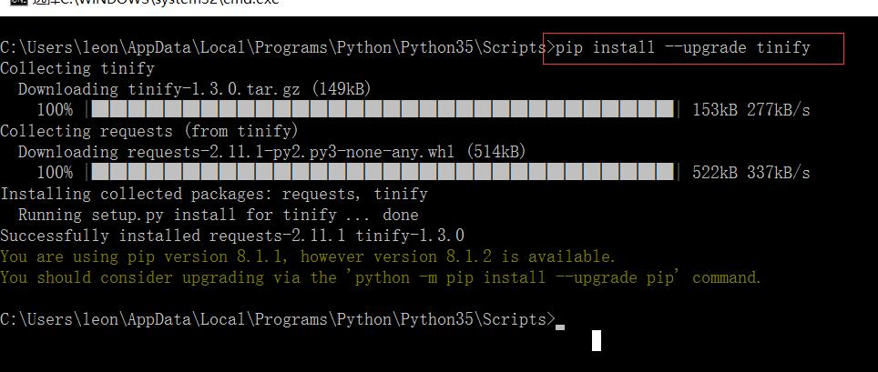
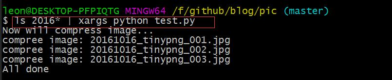

# github怎么把图片压缩了再提交  

>　　平常截图基本都用QQ截图，但办公时没有登录QQ，用的搜狗截图，倒也很方便。但今天发现截图太大了，截个全屏图有1M大小。而使用最新版的QQ截图只有100多k，这得把图压缩一下才好，就想到喜欢的压缩图的网站[https://tinypng.com](https://tinypng.com)。搜狗截的图能压缩70%，还不错。看到tinypng有开发接口，就搞了个。这样压缩图就方便多了。  

***

## 如何使用tinypng的API  
　　tinypng的网页上已经写得很清楚，这里简要说一下python的接口    

* 注册开发者账号  
填个名字和邮箱就能收到开发者key了，免费用户一个月可以压缩500张图  
  
收到的key  
  

* 安装python包  
使用pip安装python包  
  

* 写个程序测试一下
只需要四行就可以压缩一个图片了，很简单有木有    
`import tinify`  
`tinify.key = "7vXsNCs64jLDs2sPi-UO6Vx9_os1I__5"`  
`source = tinify.from_file("QQ截图20161016212623.jpg")`  
`source.to_file("QQ截图20161016212623_tiny.jpg")`  

***

## 写个完整python程序  
　　把上面的例子再加上参数处理我觉得就够用了  

```python
#!/usr/bin/python
#coding=utf-8

# 问题:打印延迟，会一起打印出来

import sys,tinify

print("Now will compress image...")
tinify.key = "7vXsNCs64jLDs2sPi-UO6Vx9_os1I__5"

for i in range(1, len(sys.argv)):
    print("compree image: " + sys.argv[i])
    source = tinify.from_file(sys.argv[i])
    source.to_file(sys.argv[i])
    
print("All done")
```
再把这个python脚本放到PATH的环境变量路径中去，以后要压缩图片只需要`compress_img.py image.jpg`就可以了  

***

## 以后提交到github前怎么做呢  
在git add pic之前先执行如下压缩命令就可以把今天的图片全部压缩了    
`ls 20161016* | xargs python compress_img.py` 
  
windows上也是这个命令唷，因为你装了git bash，打开git bash就可以执行部分linux shell命令，爽得很  

