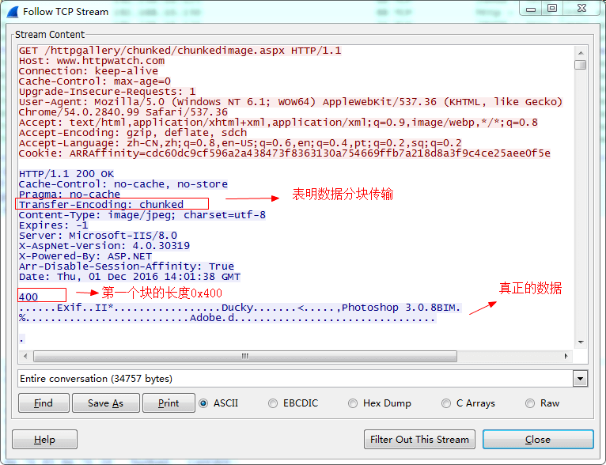
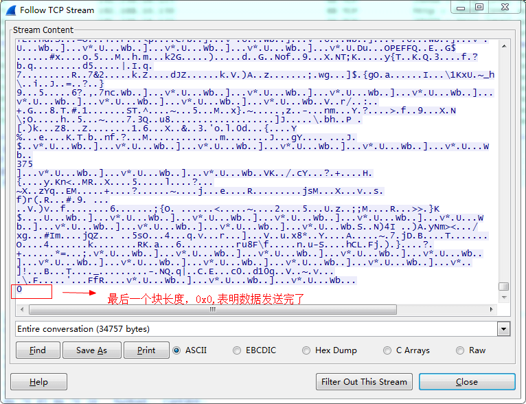

# http协议里的chunked编码与测试  

> 如果有写过http下载的人，或多或少了解一点chunked编码的传输方式。例如笔者最初不知道这个http传输方式，以前能行的代码有一天就突然不行了，抓包才发现数据异样。  

## chunked编码  
　　分块传输编码（Chunked transfer encoding）是只在HTTP协议1.1版本（HTTP/1.1）中提供的一种数据传送机制。以往HTTP的应答中数据是整个一起发送的，并在应答头里Content-Length字段标识了数据的长度，以便客户端知道应答消息的结束。  

### 好处  

1. 对于动态生成的应答内容来说，内容在未生成完成前总长度是不可知的。因此需要先缓存生成的内容，再计算总长度填充到Content-Length，再发送整个数据内容。这样显得不太灵活，而使用分块编码则能得到改观。  
2. 分块传输编码允许服务器在最后发送消息头字段。例如在头中添加散列签名。  
3. 对于压缩传输传输而言，可以一边压缩一边传输。  

### 格式  
　　如果在http的消息头里Transfer-Encoding为chunked，那么就是使用此种编码方式。接下来会发送数量未知的块，每一个块的开头都有一个十六进制的数,表明这个块的大小，然后接CRLF("\r\n")。然后是数据本身，数据结束后，还会有CRLF两个字符。有一些实现中，块大小的十六进制数和CRLF之间可以有空格。  
　　最后一块的块大小为0，表明数据发送结束。最后一块不再包含任何数据，但是可以发送可选的尾部，包括消息头字段。消息最后以CRLF结尾。  

* 抓包截图  
  
   

## 如何测试支持chunked编码    
　　如何测试自己的程序支持接收这种编码方式的数据呢？第一想到的当然是配下服务器，使其固定以这种方式发数据，但是没有搜索到如果把apache配成这个模式。好在强大的Stack Overflow里找到了有用信息。  
　　http://www.httpwatch.com/httpgallery/chunked/chunkedimage.aspx 这个页面就是chunked编码传输的。只需要测试看能否正确下载这个页面就可以了，分块发送时服务器是每0.1s发送1k的数据过来。  
　　  

**参考**  
*维基百科：https://zh.wikipedia.org/wiki/%E5%88%86%E5%9D%97%E4%BC%A0%E8%BE%93%E7%BC%96%E7%A0%81*  