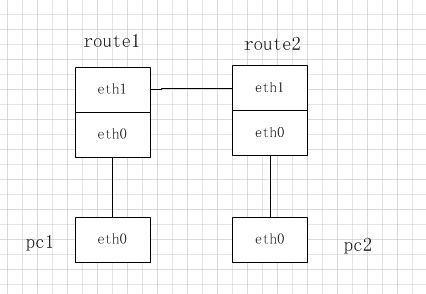

# netkit-ng安装使用  
@(工作笔记)[工作笔记, netkit]  
  
[TOC]  
  
>　　netkit是基于Linux的开源网络实验环境，通过启动多个linux虚拟机来模拟路由器，交换机，主机等，从而进行网络功能的模拟。netkit-ng是netkit的分支，为最新的debian内核和文件系统带来支持。  
  
## 安装netkit-ng  
完整的Netkit-NG包括三个不同的包：    
* Netkit-NG “core”，其中包含Netkit所需的命令，文档和其他内容;  
* Netkit-NG filesystem，其中包含虚拟机的文件系统;  
* Netkit-NG kernel，其中包含虚拟机使用的内核  
  
### 下载   
先下载如下三个文件到同一目录：  
* [netkit-ng-core-32-3.0.4.tar.bz2](https://github.com/netkit-ng/netkit-ng-core/releases/download/3.0.4/netkit-ng-core-32-3.0.4.tar.bz2)  
* [netkit-ng-filesystem-i386-F7.0-0.1.3.tar.bz2](https://github.com/netkit-ng/netkit-ng-build/releases/download/0.1.3/netkit-ng-filesystem-i386-F7.0-0.1.3.tar.bz2)  
* [netkit-ng-kernel-i386-K3.2-0.1.3.tar.bz2](https://github.com/netkit-ng/netkit-ng-build/releases/download/0.1.3/netkit-ng-kernel-i386-K3.2-0.1.3.tar.bz2)  
  
解压上面下载的文件：  
```bash  
$ tar -xjSf netkit-ng-core-32-3.0.4.tar.bz2  
$ tar -xjSf netkit-ng-filesystem-i386-F7.0-0.1.3.tar.bz2  
$ tar -xjSf netkit-ng-kernel-i386-K3.2-0.1.3.tar.bz2  
```  
  
### 配置  
设置如下环境变量，NETKIT_HOME目录改为自己的（为了重启后还能生效，可以放.bashrc里）  
```  
export NETKIT_HOME=/home/work_sdb1/tenda2/netkit-ng/netkit-ng  
export MANPATH=$MANPATH:$NETKIT_HOME/man  
export PATH=$PATH:$NETKIT_HOME/bin  
```  
进入netkit-ng目录，执行检查脚本：  
`./check_configuration.sh`  
我的系统提示没有安装wireshark，安装后再执行一遍就提示OK了。  
  
## 如何使用  
安装netkig-ng环境还是很轻松的，如何使用是一个比较复杂的问题。在netkit的[官网](http://wiki.netkit.org/index.php/Labs_Official)可以找到一些资料，其中包含详细的PDF文档描述和示例文件。虽然PDF都是英文的，但可以略知一二。下面举例一个简单的例子。  
  
### 2台PC，2台路由的静态环境模拟  
1. 新建一个目录例如test ，它下面的文件树如下  
```  
.  
├── lab.conf  
├── pc1  
├── pc1.startup  
├── pc2  
├── pc2.startup  
├── route1  
├── route1.startup  
├── route2  
└── route2.startup  
```  
**lab.conf**  
这是很重要的一个文件，它描述了网络top图，本示例的内容如下  
```  
LAB_DESCRIPTION="leon test, 静态路由连接，PC1可以ping通PC2算成功"  
LAB_VERSION="0.1"  
LAB_AUTHOR="leon"  
LAB_EMAIL="xxx@qq.com"  
  
route1[1]=B  
route1[0]=A  
route2[1]=B  
route2[0]=C  
pc1[0]=A  
pc2[0]=C  
```  
前面的一些描述信息是可选的，后面是网络拓扑描述：  
route1[1]=B     route1只是一个名字，[1]表示route1 eth1接口，B表示B网络  
route1[0]=A     route2只是一个名字，[0]表示route1 eth0接口，A表示A网络  
...  
通俗易懂的话讲就是，route1的eth1接口和route2的eth1接口相连，route1的eth0接口和pc1的eth0接口相连，route2的eth0接口和pc2的eth0接口相连。如下图：  
  
  
**xxx.startup**  
这类文件是对应虚拟机（route1,route2,pc1,pc2）的启动脚本，虚拟机文件夹为空就好。启动脚本里面主要是配置网卡地址和路由，具体内容如下  
*route2.startup*  
```  
ifconfig eth0 192.168.55.1 up  
ifconfig eth1 192.168.3.200 up  
ip route add default via 192.168.3.100 dev eth1  
```  
*route1.startup*  
```  
ifconfig eth0 192.168.0.1 up  
ifconfig eth1 192.168.3.100 up  
ip route add default via 192.168.3.200 dev eth1  
```  
*pc1.startup*  
```  
ifconfig eth0 192.168.0.100 up  
ip route add default via 192.168.0.1 dev eth0  
```  
*pc2.startup*  
```  
ifconfig eth0 192.168.55.100 up  
ip route add default via 192.168.55.1 dev eth0  
```  
  
2. 启动我们建立的虚拟网络  
需要在linux的图形界面下启动，首先进入我们创建的目录（cd test），然后执行`lstart`命令即可，就可以看到四个虚拟机启动起来了，而且在PC2里面可以ping通PC1，表示环境虚拟成功。  
  
如果要关闭虚拟环境，执行lcrash命令即可。  
  
### 一台路由，一台PC连接外部互联网  
连接外部互联网需要把netkit lab里面的虚拟机和你的linux主机通过tap口连在一起，然后配置相应的路由和iptables规则就可以了。具体配置如下：  
*lab.conf*  
```  
LAB_DESCRIPTION="leon test, 连接真实的网络环境，pc1可以ping通8.8.8.8算成功"  
LAB_VERSION="0.1"  
LAB_AUTHOR="leon"  
LAB_EMAIL="xxx@qq.com"  
  
route1[1]=tap,10.0.0.1,10.0.0.2  
route1[0]=A  
pc1[0]=A  
  
# 其中遇到一点问题，我的ubuntu也是虚拟机，通过nat模式连接外网。在测试时发现，  
# pc1 ping 8.8.8.8时，数据包可以出去，但回来时找不到10.0.0.2的主机是谁，ping不同。  
# 在ubuntu的iptables规则里面添加一条nat规则就可以了  
# iptables -t nat -A POSTROUTING -o eth0 -j MASQUERADE  
```  
*route1.startup*  
```  
ifconfig eth0 192.168.0.1 up  
iptables -t nat -A POSTROUTING -o eth1 -j MASQUERADE  
```  
*pc1.startup*  
```  
ifconfig eth0 192.168.0.100 up  
ip route add default via 192.168.0.1 dev eth0  
```  
在linux主机上可以看到创建了一个tap接口  
```  
nk_tap_root Link encap:Ethernet  HWaddr 7e:04:1f:bc:2a:48    
          inet addr:10.0.0.1  Bcast:10.255.255.255  Mask:255.0.0.0  
          inet6 addr: fe80::7c04:1fff:febc:2a48/64 Scope:Link  
          UP BROADCAST RUNNING MULTICAST  MTU:1500  Metric:1  
          RX packets:137 errors:0 dropped:0 overruns:0 frame:0  
          TX packets:117 errors:0 dropped:0 overruns:0 carrier:0  
          collisions:0 txqueuelen:500   
          RX bytes:13026 (13.0 KB)  TX bytes:17804 (17.8 KB)  
```  
而且route1和linux主机都会添加相应的路由。  
由于我的linux主机环境也是虚拟机，所以还需要在linux主机上执行一条命令，才可以完全连通`iptables -t nat -A POSTROUTING -o eth0 -j MASQUERADE`,eth1为我的ubuntu虚拟机上网的网卡。  
  
  
### 如何装dhcp服务器    
在netkit里面已经有很多预装的软件了，像quagga, radvd, pppd这些都有，但我貌似没发现dhcp服务器，就琢磨了一下。首先我直接烤了我ubuntu的dhcpd进去，运行发现提示，libc版本不对，运行不了。。但我编译一个hello world程序进去又可以跑起来，估计是dhcpd程序使用了一些高版本C库的特性。后面又琢磨编译一个可以的版本进去，但没实践出来。后来发现其实不用这么复杂，**直接apt-get install就好**  。    
  
#### 写时复制的文件系统  
netkit安装的文件系统是所有虚拟机共用的，当在虚拟机里面修改文件系统时会把修改部分复制到本地。例如，我通过`vstart test`启动一个名为test的虚拟机，然后在虚拟机里面通过命令`echo 222 > 222.txt`创建一个文件，然后再关机。ls可以看到本地多了一个test.disk文件。而且大小很吓人，2G！  
```  
$ ls -lh test.disk  
-rw-r--r-- 1 root   root    2.1G Aug 12 08:48 test.disk  
```  
通过file命令查看：  
```  
$ file test.disk  
test.disk: User-mode Linux COW file, version 3, backing file /home/work_sdb1/tenda2/netkit-ng/netkit-ng/fs/netkit-fs  
```  
我觉得它是一个稀疏文件，实际占不了这么大磁盘空间，再通过du命令查看：  
```  
$ du -h test.disk  
856K    test.disk  
```  
可以删掉这个文件，只是你对这个虚拟机的修改就没有了。  
  
  
#### 如何修改netkit的默认文件系统  
**注意修改了文件系统，所有虚拟机都会改！**  
在[netkit-ip-dhcp资料](http://stud.netgroup.uniroma2.it/~cgrl/2017/slides/2-netkit-ip-dhcp.pdf)中有提及，`vstart -W test`或者`mount -o loop,offset=32768 $NETKIT_HOME/fs/netkit-fs/mnt/nkfs`（虚拟机默认32M内存）。其中vstart -W的命令试了下，最简单。  
  
##### v系命令简介    
在netkit里面有vcommand和lcommand，例如常使用的vstart, vcrash, lstart, lcrash, l即lab的意思，构建复杂的网络拓扑环境使用l系命令最好。如果单个虚拟主机vstart就最简单了。  
`vstart pc1`就可以立马启动一个名为pc1的虚拟机了，一样可以通过命令行参数来配置网卡什么的，`vcrash pc1`粗暴的关闭虚拟机, `vhalt pc1`优雅的关闭虚拟机。具体命令参数可以通过man vstart查看。    
  
#### 使用apt-get安装软件    
要在虚拟机里面装软件，需要什么条件呢？**能连上网**。所以需要tap接口连接外部主机的网络，这里可以参考连接外部互联网的实验。步骤如下：  
1. 使用vstart命令启动一个虚拟机    
`vstart test --eth1=tap,10.0.0.1,10.0.0.2 --mem=128`    
虚拟机名字为test，eth1接口通过tap接口与外部主机相连，内存分配为128M，**虚拟机默认内存为32M，如果不改的话，内存太小，装不上软件，提示fork失败**。  
2. 配置域名解析  
`echo nameserver 114.114.114.114 >/etc/resolv.conf`  
这时应该可以ping通百度了  
3. 更新软件列表  
`apt-get update`  
4. 安装软件  
`apt-get install isc-dhcp-server`  
  
软件安装成功，`dhcpd -h`运行正常。但是这样搞了之后只有当前虚拟机有，其他虚拟机如果要还要重新装。不要慌，前面已经讲了修改文件系统的方法。这里只需要修改第一步，多加一个`-W`参数，即`vstart test -W --eth1=tap,10.0.0.1,10.0.0.2 --mem=128`，最后关虚拟机的时候不要用vcrash，用vhalt！  
  
#### 修改开机启动项    
　　在上面安装了dhcpd后，默认会开机启动，但我们一般不需要开机启动(虽说因为配置文件不对一般起不来)。所以需要继续修改文件系统。    
`cat /etc/inittab`发现默认启动级别为2    
    
那么我们只需要删除`/etc/rc2.d/`里面的dhcpd启动脚本即可，即`rm /etc/rc2.d/S06isc-dhcp-server`。再重启就发现不会启动dhcpd了。  
  
  
### 解决各虚拟机之间的依赖关系    
 　　例如我PC2的启动脚本里面有`dhclient eth0`命令来动态获取地址，为了能正常获取到地址，他取决于其依赖的ROUTE2是否启动。所以需要在启动PC2前先启动ROUTE2，要实现这种依赖关系也很简单，在你的lab文件夹新建一个lib.dep文件，里面写如下内容即可：  
 ```  
 # pc2 依赖 route2，须让route2先启动  
pc2: route2  
 ```  
  
  
  
