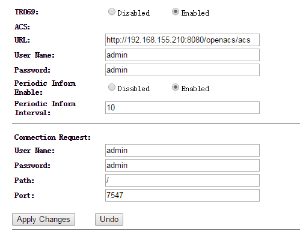
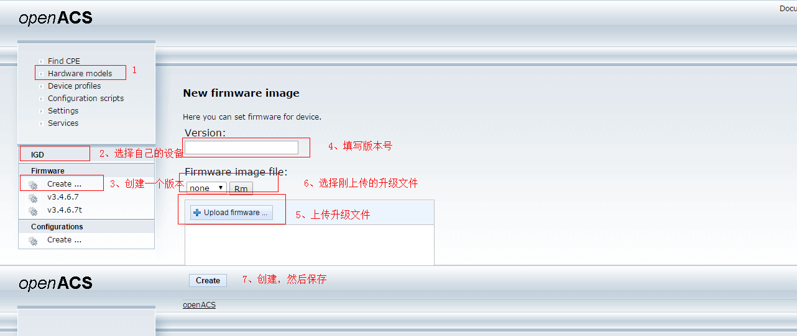
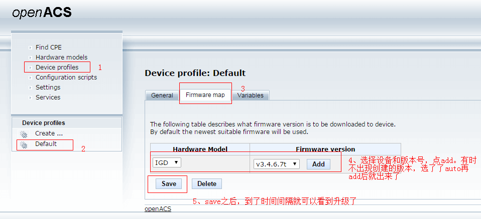

# openacs测试tr069

## openacs搭建启动

* 虚拟机下载：http://pan.baidu.com/s/1ntQck57

* 虚拟机用户名： root, 密码 ：openacs

* 开启openacs 

  ```shell
  cd /opt/jboss/bin
  ./run.sh -b 0.0.0.0
  ```

  *有时虚拟机启动自动就起了jboss进程，这时手动起就会出现端口已被使用的错误，可以先检查一下是否起了`ps aux | grep jboss`*

* 测试是否可以访问服务器页面http://192.168.155.210:8080/openacs/（user: admin, password: openacs）

## CPE配置

  

　　*Path 和 port可以不用填*

## 测试脚本

> ACS设置：
>
> 1. 在openacs的配置页面，进入find CPE页面，选择Hardware，再输入SerialNumber（一般为WAN口mac地址）查询设备。
> 2. 在Configuration scripts->Default里面输入如下脚本，点击保存。在下一个 periodevent time到了之后就可以看到交互的数据包了。

### 设置参数

* 设置SSID

  ```javascript
   var parameters = new Array ();
   parameters[0] = {name:'InternetGatewayDevice.LANDevice.1.WLANConfiguration.1.SSID', value: '1232312'};
   cpe.SetParameterValues (parameters, "commandKey");
  ```
  参数默认类型为string，如果不是string需要指明类型，否则会报不合法类型错误，如下

  ```javascript
  var parameters = new Array ();
  parameters[0] = {name:'InternetGatewayDevice.IPPingDiagnostics.NumberOfRepetitions', value: '2',type: 'xsd:unsignedInt'};
  cpe.SetParameterValues (parameters, "commandKey");
  ```

  ​

* 设置WAN静态IP

  ```javascript
  var parameters = new Array ();
  parameters[0] = {name:'InternetGatewayDevice.WANDevice.1.WANConnectionDevice.1.WANIPConnection.1.AddressingType', value: 'Static'};
  parameters[1] = {name:'InternetGatewayDevice.WANDevice.1.WANConnectionDevice.1.WANIPConnection.1.DNSServers', value: '3.3.3.3'};
  parameters[2] = {name:'InternetGatewayDevice.WANDevice.1.WANConnectionDevice.1.WANIPConnection.1.DefaultGateway', value: '192.168.155.1'};
  parameters[3] = {name:'InternetGatewayDevice.WANDevice.1.WANConnectionDevice.1.WANIPConnection.1.ExternalIPAddress', value: '192.168.155.200'};
  parameters[4] = {name:'InternetGatewayDevice.WANDevice.1.WANConnectionDevice.1.WANIPConnection.1.SubnetMask', value: '255.255.255.0'};
  cpe.SetParameterValues (parameters, "commandKey");
  ```

### 获取参数

* GetParameterValues

  ```javascript
  var parameters = new Array ();
  parameters[0] ='InternetGatewayDevice.LANDevice.1.WLANConfiguration.1.';
  var response = cpe.GetParameterValues (parameters);
  ```

  ​

* GetParameterAttributes

  ```javascript
  var parameters = new Array ();
  parameters[0] ='InternetGatewayDevice.LANDevice.1.WLANConfiguration.';
  var response =cpe.GetParameterAttributes(parameters);
  logger(response[0].name+'='+response[0].value);
  ```

  ​

### 升级

1. 页面配置方法

   

   ​

2. 脚本配置方法

   ```javascript
   logger("FIRWARE UPGRADE STARTING"); 
   var response = cpe.Download("daCommand", "1 Firmware Upgrade Image","http://192.168.155.210:8080/openacs/firmware/fw.bin","", "", 0,"fw.bin"); 
   logger ("FIRWARE UPGRADEst="+response.StartTime+" ct="+CompleteTime+"status="+response.Status); 
   logger ("FIRWARE UPGRADEDONE"); 
   ```

   **升级文件先通过页面的Hardware models那儿传上去**

   参数：Download( “”, “文件类型”, "服务器下载地址", "用户名", "密码", "文件长度", "文件名")，文件长度填0即可

   ​

### 下载配置文件

```javascript
var response = cpe.Download("daCommand", "3 Vendor Configuration File","http://192.168.155.210:8080/openacs/firmware/tr069_config.dat","", "",000,"tr069_config.dat");

logger("st="+response.StartTime+" ct="+CompleteTime+" status="+response.Status);
```


### 上传配置文件

```javascript
var response =cpe.Upload("daCommand", "3 Vendor Configuration File","http://192.168.155.210:8080/openacs/", "","",000,"config.dat");
logger("st="+response.StartTime+" ct="+CompleteTime+" status="+response.Status);
```


### 上传日志文件

```javascript
var response =cpe.Upload("daCommand", "2 Vendor Log File","http://192.168.155.210:8080/openacs/","", "",000,"upload.log");
logger("st="+response.StartTime+" ct="+CompleteTime+"status="+response.Status);
```

**注意这几个文件类型字段的变化**:`1 Firmware Upgrade Image` `2 Vendor Log File` `3 Vendor Configuration File`

***注意：***

　　测试重启，升级，导入配置这种。测试完后立即把openacs重新配一下，以免循环执行脚本，影响正常测试。

-----

## 其他

### openacs的bug？

* 参数树不及时更新，即便有时抓包看，参数树已经上报了
* 通过页面设置参数有时不成功，但是通过脚本配又是可以的
* 在Device Profiles->variables页面，查看节点树的属性有时一直查看不了