# PyQt5初级教程hello world  
> 本文主要介绍环境的安装和用QT拖控件实现一个简单的hello程序  

## PyQt5安装  
经过我的多次尝试，发现python3.5才能顺利装上PyQt5。安装方法很简单,一条命令搞定  
`pip install pyqt5`  
可以用如下代码测试环境是否安装成功，运行成功会出现一个窗口：  
```python
from PyQt5 import QtWidgets, QtGui
import sys

app = QtWidgets.QApplication(sys.argv)
window = QtWidgets.QWidget();
window.show()
sys.exit(app.exec_())
```  

## QT Creator安装  
因为我们需要使用Qt design来设计界面，所以需要安装Qt Creator。直接官网下载安装就好，比较大，需要耐心等待。  

## QT Creator绘制界面  

* 打开Qt Creator，新建一个工程，QT -> Qt设计师界面类 -> Widget -> 保存  
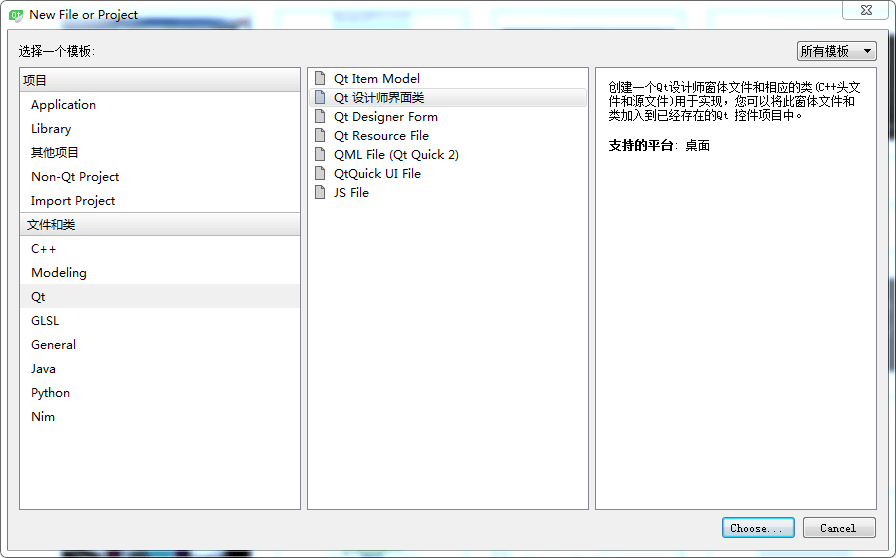  
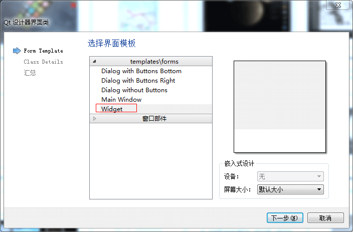  
默认保存就好，不用管保存为form.cpp哪里，因为我们只需要form.ui这个文件  
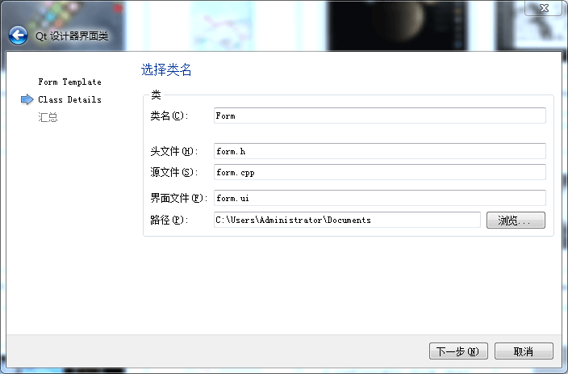  

* 主界面简单介绍  
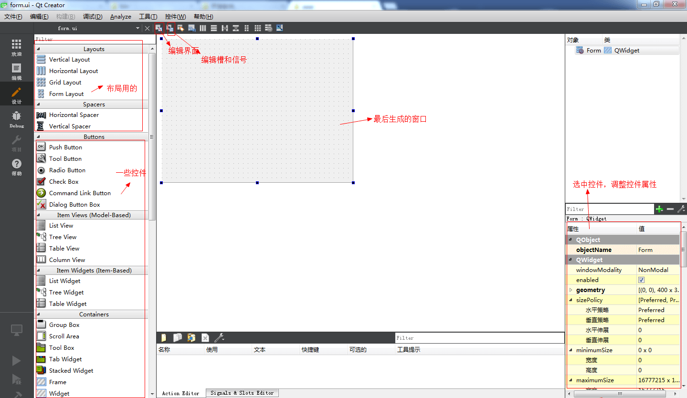  

* 拖动控件绘制我们的窗口，改变默认值  
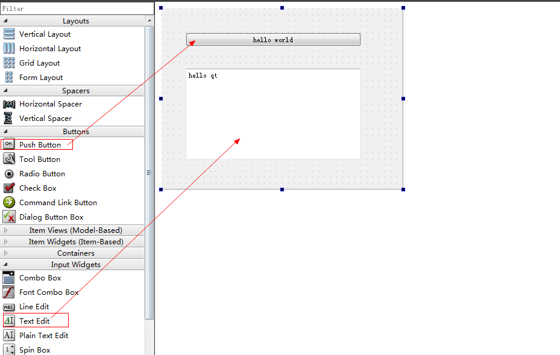  

* **编辑信号和槽**，选择信号槽编辑，选中button添加监听clicked事件，槽函数我们自定义为hello()  
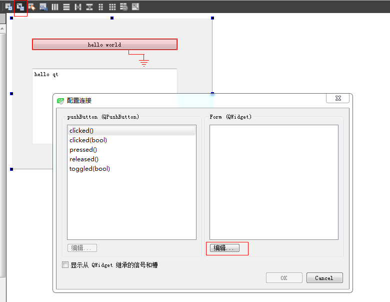  
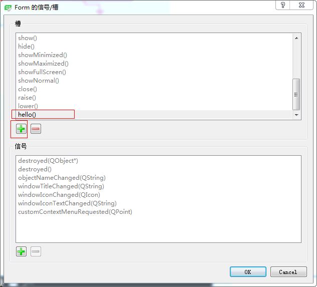  
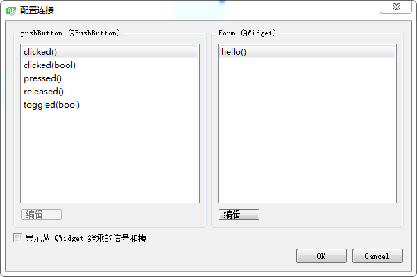  

* 然后保存  
* **把form.ui文件编译为form.py文件**  
去之前保存form.ui的目录，shift+右键，在当前路径打开控制台，执行如下命令  
`pyuic5 form.ui -o form.py`  
如果找不到pyuic5可执行程序，检查一下环境变量是否正确  

至此界面已经生成，后面就是使用form.py这个界面了  

## 使用Qt Design生成的界面    

打开这个form.py这个文件，可以看到生成了Ui_Form这个类，有一些我们添加的控件。我们只需要导入类，做初始化，然后编写自定义的槽函数就可以了。  
代码如下:  
```python
from PyQt5 import QtWidgets, QtGui
import sys

from form import Ui_Form    # 导入生成form.py里生成的类

class mywindow(QtWidgets.QWidget,Ui_Form):    
    def __init__(self):    
        super(mywindow,self).__init__()    
        self.setupUi(self)

    #定义槽函数
    def hello(self):
        self.textEdit.setText("hello world")

app = QtWidgets.QApplication(sys.argv)
window = mywindow()
window.show()
sys.exit(app.exec_())
```
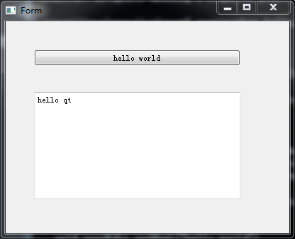  
点击之后按钮之后编辑框变为hello world  
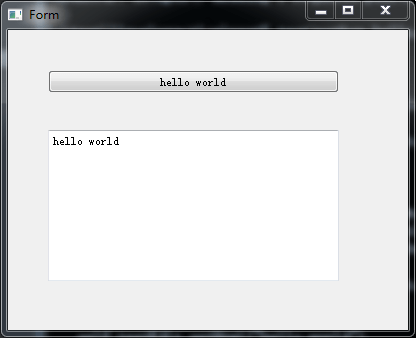  

## 帮助文档使用  

有了上面的简单例子，就可以依葫芦画瓢做一些简单的应用了。但对一个控件，往往需要了解它的属性方法，才能方便我们编程。  
官方文档网站 http://pyqt.sourceforge.net/Docs/PyQt5/index.html 打开点进去之后是C++的，觉得很纳闷。后面就理解了，pyqt5安装的时候会安装SIP，SIP的作用就是让python调用C,C++函数，所以pyqt5实则就是调用了QT C++的库，那么看QT C++库的帮助文档也一样。  
拿上面例子的QTextEdit类来说，可以直接在QT Creator里看（毕竟是离线的）。帮助 -> Qt5.7.1 Reference Documentation -> class,然后搜索就可以了  
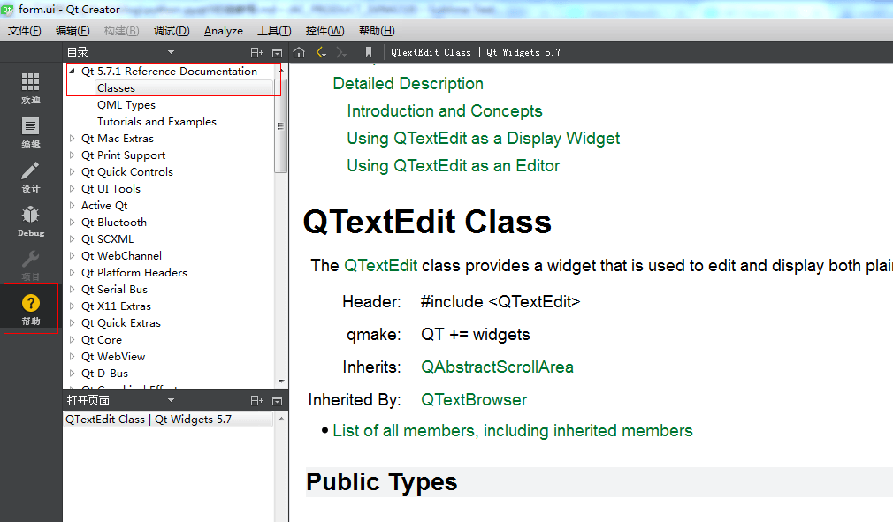  
我们就可以在Public Slots里面找到setText方法了  
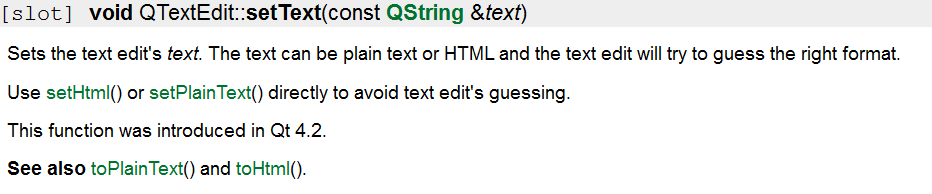  


