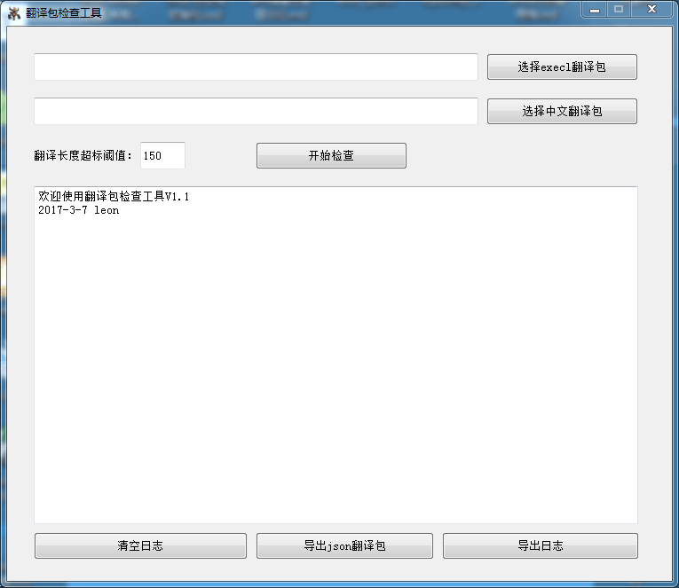

### python学习交流  
@(python)[python]  
  
#### 一、为什么学习python  
1. 听说很好用  
2. 实际很好用  
	1）跨平台，linux和windows都可以正常运行  
　2）丰富的库支持  
  
#### 二、基础学习  
　　如果要系统的学习python，你可能需要购买一本讲解比较精细的书籍。如果只是想快速开发出点小东西，那么大多在线学习[网站](http://www.runoob.com/python/python-intro.html)即可满足需求。  
　　需要熟悉基础语法，如条件语句，循环语句，运算符，关键字，函数等，标准库里面的字符串，列表，字典类。  
#### 三、使用它  
　　学习完上面的基础知识，可能就摩拳擦掌想练手了，我那时写代码的经历是这样：google查一下，写三行代码，Google再查一下，再写两行代码...，最后写完，28行代码，运行，报错，再Google一下...。Cool！ 它按照我的预期执行了。  
```python  
#!/usr/bin/python  
#coding=utf-8  
  
# 扫描某个网段的特定端口  
# example: ./scanport.py 192.168.98.11-50 23  
# 2016 年4月 9日15:27:47  
  
import sys,os  
  
def usage():  
    print '''help:\nexample: ./scanport.py 192.168.98.11-50 23 '''  
  
def main(argc, argv):  
    if argc < 3:  
        usage()  
        sys.exit( -1)  
  
    netip = argv[1 ][0:argv[ 1].rfind('.' )]  
    port = argv[2 ]  
    floor = int (argv[1][argv[ 1].rfind('.' )+1 :argv[1].rfind( '-')])  
    top = int (argv[1][argv[ 1].rfind('-' )+1 :])  
  
    for i in range(floor,top +1):  
        hostip = netip + '.' + str (i)  
        cmd = "nc -w 1 -v -z %s %s " % (hostip, port)  
        os.system(cmd)  
  
if __name__ == '__main__' :  
    main( len(sys.argv),sys.argv)  
  
```  
　　是的，python开发过程中的大半时间都是在Google中。总会有新的库需要学习，总会忘记某个函数的参数，总会有奇怪的异常。适应就好了，因为使用python确实能在短时间内完成你的需求。  
##### IDE  
1. 轻型文本编辑器 sublime text  
2. 重型IDE Pycharm（可以代码补全）  
  
#### 四、python和C程序的整合  
　　python这种解释器语言写的代码是跑得很慢很慢的，当运行速度成为瓶颈时，可以考虑将关键模块用C,C++语言来实现。  
　　可以使用ctypes模块来实现这一点。因为C语言和python数据结构的不一致，所以基本对所有的C函数都会进行再次封装，感觉很麻烦，没用过。我一般用基本输入输出来实现python和C程序的整合。  
　　如果练手看示例可以参考[浅谈 Python 程序和 C 程序的整合](https://www.ibm.com/developerworks/cn/linux/l-cn-pythonandc/)  
  
  
  
#### 五、利用pyqt5实现GUI开发  
可以看下以前写的教程和出错问题解决：  
1. [python pyqt5安装失败问题](http://blog.csdn.net/u013401853/article/details/54573659)  
2. [python PyQt5初级教程hello world](http://blog.csdn.net/u013401853/article/details/54581512)  
3. [使用pyinstaller打包pyqt5出错问题解决](http://blog.csdn.net/u013401853/article/details/54428434)  
  
  
#### 六、爬虫开发  
　　利用requests库和pyquery库实现对网页数据的提取，通过分析network数据，模拟提交查询数据。  
　　下面是一个查询公司考勤记录的脚本，如果考勤异常则发送邮件通知：  
```python  
#!/usr/bin/python3  
  
# 定时查询考勤签卡，如有异常，发送邮件通知  
  
# 配置文件/etc/check_late.conf  
# {  
#     "username": "123",  
#     "password": "123",  
#     "mail_user": "xxxxx@qq.com",  
#     "mail_pass": "xxx",  
#     "mail_receiver": "123@qq.com",  
#     "log_path": "/var/log/check_late.log"  
# }  
  
  
import requests, time  
from pyquery import PyQuery as pyq  
import json, sys  
  
#######################################################  
  
import smtplib  
from email.mime.text import MIMEText  
from email.header import Header  
  
def send_email(msg=""):  
    # 第三方 SMTP 服务  
    #mail_host="smtp.tenda.cn"  #设置服务器,使用外网时可以用这个发邮件  
    mail_host="172.16.105.207"  #内网服务器  
    mail_user=config["mail_user"]    #用户名  
    mail_pass=config["mail_pass"]  #口令  
  
    receivers = []  
    receivers.append(config["mail_receiver"])  
    mail_msg = "Hi:<br/>&nbsp;&nbsp;{}".format(msg)  
    message = MIMEText(mail_msg, 'html', 'utf-8')  
    message['From'] = Header(config["mail_user"], 'utf-8')  
    message['To'] =  Header(config["mail_receiver"], 'utf-8')  
  
    subject = '考勤异常'  
    message['Subject'] = Header(subject, 'utf-8')  
  
    try:  
        smtpObj = smtplib.SMTP()  
        smtpObj.connect(mail_host, 25)    # 25 为 SMTP 端口号  
        smtpObj.login(mail_user,mail_pass)  
        smtpObj.sendmail(mail_user, receivers, message.as_string())  
        print("send email success", file=open(log_path, mode="a"))  
    except:  
        print("Error: send email failed",file=open(log_path, mode="a"))  
        time.sleep(3*60)  
        print("sleep 3*60s", file=open(log_path, mode="a"))  
        send_email()  
  
############################################################################  
  
# 解析配置文件  
try:  
    config = json.load(open("/etc/check_late.conf"))  
except:  
    print("parse /etc/check_late.conf faild")  
    sys.exit(0)  
  
if config.get("log_path"):  
    log_path = config["log_path"]  
else:  
    log_path = "/var/log/check_late.log"  
  
s=requests.Session()  
login_data={  
    "txtUserNo": "123",  
    "txtPassword": "123",  
    "ddListLanguage": "0",  
    "btnLogin": "登录",  
    # 这个字段是变化的，在请求的default.aspx页面里面可以获取这个值  
    "__VIEWSTATE": "/wEPDwUKLTUzNTE4NDY3OA8WBB4JTG9naW5UeXBlAv////8PHgxIYXJkd2FyZVR5cGUFAjAxFgICAw9kFgQCAQ8PFgIeBFRleHRlZGQCCA8PFgIeB1Zpc2libGVoZGRkQAmCfQQ5/eRk0UlDVuTpbtI/kGpiMNP4H/dO4qwS0I8="  
}  
  
# 获取__VIEWSTATE动态字段  
jq = pyq("http://172.16.100.5:1808/Default.aspx")  
login_data["__VIEWSTATE"] = jq("#__VIEWSTATE").val()  
  
login_data["txtUserNo"] = config["username"]  
login_data["txtPassword"] = config["password"]  
  
# 登录  
s.post("http://172.16.100.5:1808/Default.aspx", login_data)  
  
# 查询  
check_data={  
    "queryid": "23",  
    "sqlwhere": "\" YYMMDD >= '2017/06/01' AND YYMMDD <= '2017/06/07' AND EmpNo = '0005521'\"",  
    "modulename": "日考勤"  
}  
  
# 时间计算，垮月的情况计算  
now = time.localtime()  
if now.tm_mday < 6:  
    start = "{}/{:02d}/{:02d}".format(now.tm_year, now.tm_mon - 1, 25 + now.tm_mday)  
else:  
    start = "{}/{:02d}/{:02d}".format(now.tm_year, now.tm_mon, now.tm_mday - 5)  
end = "{}/{:02d}/{:02d}".format(now.tm_year, now.tm_mon, now.tm_mday - 2)   # 跳过今天和昨天  
  
print("查询:[{}] {} - {}".format(config["username"], start, end), file=open(log_path, mode="a"))  
  
check_data["sqlwhere"] = "\" YYMMDD >= '{}' AND YYMMDD <= '{}' AND EmpNo = '{}'\"".format(start,  
    end, config["username"])  
  
r=s.post("http://172.16.100.5:1808/queryReport.aspx", check_data)  
  
# 获取查询的页面表格  
jq = pyq(r.text)  
table = jq("#ctl00_ContentPlaceHolder1_GridView1")  
  
# 重新初始化pyq，避免其他tr标签干扰  
jq = pyq(table)  
tr = jq("tr")  
  
# 打印出查询信息  
for i in tr:  
    # print(pyq(i).text())  
    result = pyq(i).text()  
    if result.find(config["username"]) != -1 and result.find("异常") != -1:  
        # 异常，通知  
        print("异常", result, file=open(log_path, mode="a"))  
        send_email(result)  
```  
  
#### 七、如何找库  
　　1. Google问有没有XX库  
　　2. 直接去放python库的官网找(目前有110534个库) [PyPI - the Python Package Index](https://pypi.python.org/pypi)  
