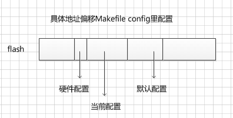

## Realtek linux SDK MIB结构


---

### 一、Flash上如何存储？

　　Flash上存储mib值的有三块，分为硬件配置、当前配置和默认配置，如下图。硬件配置的参数命名以"HW\_"开头，默认配置的参数名以“DEF\_”开头。从配置文件中也可以看到这种结构，配置文件中不仅包含默认配置，还包含当前配置。升级软件或者配置文件可以达到更改当前配置的功效。

 

　　flash上存储的mib数据如下图。在初始化的时候先读压缩头（COMPRESS_MIB_HEADER），判断是什么配置，获取压缩参数，计算解压后的长度（compRate*compLen），然后读出压缩数据并解压。解压之后的数据有个参数头（HW_PARAM_HEADER_T）。
  
```c  
/* flash上存储的mib数据
-------------------------------------------------------                      
| COMPRESS_MIB_HEADER | 	压缩的mib数据  
-------------------------------------------------------

 压缩的mib数据解压后：     
-------------------------------------------------------                  
| HW_PARAM_HEADER_T |   data
-------------------------------------------------------
*/

typedef struct compress_mib_header {
	unsigned char signature[COMP_SIGNATURE_LEN];	/* 取值为字符串COMPHS，COMPCS，COMPDS */
	unsigned short compRate;	/* 压缩率 */
	unsigned int compLen;		/* 压缩后长度 */
}__PACK__ COMPRESS_MIB_HEADER_T, *COMPRESS_MIB_HEADER_Tp;

typedef struct hw_param_header {
	unsigned char signature[SIGNATURE_LEN];  // Tag + version
	unsigned short len;
}__PACK__ HW_PARAM_HEADER_T, *HW_PARAM_HEADER_Tp;
```
  


------

### 二、两个重要结构体

　　以硬件参数为例，硬件参数是由两个全局变量来保存。一个是hwmib_table，一个是pHwSetting。hwmib_table是一个结构体的数组，定义如下（这个全局变量定义看起来会比较烦躁）：

```c
// MIB value, id mapping table
// hwmib_table使用的结构体定义
typedef struct _mib_table_entry mib_table_entry_T;
struct _mib_table_entry {
	int id;
#if defined(CONFIG_RTL_8812_SUPPORT)
	char name[40];
#else
	char name[32];
#endif
	TYPE_T type;
	int offset;		/* 该参数的value在pHwSetting里的偏移 */
	int size;
#ifdef MIB_TLV	
	unsigned short		total_size;
	unsigned short		unit_size;
	const unsigned char *default_value;
	mib_table_entry_T * next_mib_table;
#endif //#ifdef MIB_TLV	
};

#define FIELD_OFFSET(type, field)	((unsigned long)(long *)&(((type *)0)->field))
#define FIELD_SIZE(type, field)		sizeof(((type *)0)->field)
#define _TOTAL_SIZE(type, field)		sizeof(((type *)0)->field)

#define _OFFSET_SIZE_FIELD(type, field) \
	FIELD_OFFSET(type, field), \
	FIELD_SIZE(type, field), \
	_TOTAL_SIZE(type, field)
#endif //#ifdef MIB_TLV
#define _MIBHWID_NAME(name) MIB_HW_##name, #name

/* hwmib_table全局变量定义 */
mib_table_entry_T hwmib_table[]={
#ifdef MIB_TLV
#define MIBDEF(_ctype,	_cname, _crepeat, _mib_name, _mib_type, _mib_parents_ctype, _default_value, _next_tbl ) \
		{_MIBHWID_NAME(_mib_name), _mib_type, _OFFSET_SIZE_FIELD(_mib_parents_ctype, _cname), _UNIT_SIZE(_ctype), _default_value, _next_tbl},
#else
#define MIBDEF(_ctype,	_cname, _crepeat, _mib_name, _mib_type, _mib_parents_ctype, _default_value, _next_tbl ) \
			{_MIBHWID_NAME(_mib_name), _mib_type, FIELD_OFFSET(_mib_parents_ctype, _cname), FIELD_SIZE(_mib_parents_ctype, _cname)},
#endif
#define MIB_HW_IMPORT
#include "mibdef.h"
#undef MIB_HW_IMPORT

#undef MIBDEF
{0}
};
```

定义全局变量时先定义了MIBDEF宏，然后include数据文件"mibdef.h"，mibdef.h里写了很多数据，形如下面代码这种一千多行。所以上面的hwmib_table展开后是一个很大的数组。

*·mibdef.h示例*

```c
#ifdef MIB_HW_IMPORT
/* _ctype,	_cname, _crepeat, _mib_name, _mib_type, _mib_parents_ctype, _default_value, _next_tbl */
MIBDEF(unsigned char,	boardVer,	,	BOARD_VER,	BYTE_T, HW_SETTING_T, 0, 0)
MIBDEF(unsigned char,	nic0Addr,	[6],	NIC0_ADDR,	BYTE6_T, HW_SETTING_T, 0, 0)
MIBDEF(unsigned char,	nic1Addr,	[6],	NIC1_ADDR,	BYTE6_T, HW_SETTING_T, 0, 0)
MIBDEF(HW_WLAN_SETTING_T,	wlan, [NUM_WLAN_INTERFACE],	WLAN_ROOT,	TABLE_LIST_T, HW_SETTING_T, 0, hwmib_wlan_table)
#endif // #ifdef MIB_HW_IMPORT
```

*·定义ID号的地方apmib.h*

```c
#define MIB_HW_WLAN_ADDR5		511
#define MIB_HW_WLAN_ADDR6		512
#define MIB_HW_WLAN_ADDR7		513

#define MIB_HW_TX_POWER_OFDM_1S 514
#define MIB_HW_TX_POWER_OFDM_2S 515
#define MIB_HW_11N_LOFDMPWDA    516
#define MIB_HW_11N_LOFDMPWDB    517
```


　　如果留意可以看到上面的hwmib_table的结构体并没有类似value这样的成员，因为value存储在另一个结构体HW_SETTING_T里，这个结构体对应的全局变量就是pHwSetting，pHwSetting是一个指向HW_SETTING_T结构体的指针。别看下面这个结构体就几行，宏展开后结构体成员数应该成百上千。

*·HW_SETTING_T结构*

```c
typedef struct hw_setting {
#define MIBDEF(_ctype,	_cname, _crepeat, _mib_name, _mib_type, _mib_parents_ctype, _default_value, _next_tbl ) \
	_ctype _cname _crepeat;

#define MIB_HW_IMPORT
#include "mibdef.h"
#undef MIB_HW_IMPORT

#undef MIBDEF
}__PACK__ HW_SETTING_T, *HW_SETTING_Tp;
```

　　**这两个结构体如何关联起来呢？**

可以看到，mib_table_entry_T结构存储一个变量的ID，名称，偏移，长度，类型等，唯独不存值。而HW_SETTING_T则只单单存储了变量的value。 这两个结构体的映射关系通过mib_table_entry_T结构体的offset成员建立。offset存储的该参数对应在HW_SETTING_T里的偏移量，所以取某个参数的值时就类似这样用：

`pvalue = pHwSetting + hwmib_table[mib_search_by_id(OP_MODE)].offset`


---

### 三、初始化数据

　　flash上解压后的数据是TLV格式(type,len,value)。其中type保存的就是某个参数ID号。通过ID号在hwmib_table数组里面查找这个参数，找到后就能获取到参数在pHwSetting里的offset，然后把value拷贝到pHwSetting的对应偏移处就算完成了这个参数的初始化了。

> 初始化TLV数据时的调用：`mib_tlv_init`->`mib_tlv_init_from`->`mib_search_by_id`->`mib_init_value`


---

### 四、提供的外部接口

* 共享库的形式

　　apmib模块通过编译为共享库来供其他进程使用，在apmib里使用了很多全局变量，但没有加互斥访问，因此对于多线程的进程是**存在安全隐患**的。接口有很多，这里只粗略列这么三个。

```c
int apmib_get(int id, void *value)
int apmib_set(int id, void *value)
int apmib_update(CONFIG_DATA_T type)	/* 保存当前配置到flash的current配置区 */
```

* 命令行的形式

　　进程可通过命令行flash get/set命令来获取参数，查找的方式不是用id字段，而是用name字段。


------

### 五、升级配置

　　在formUpload的cgi里保存上传的升级文件，升级配置的数据，然后设置升级标志的全局变量。在boa的主循环判断升级标志执行升级函数FirmwareUpgrade。


---

### 六、添加参数

　　从结构可知改代码是必须的，可不是简单的在串口"nvram set xxx"那么简单。首先在apmib.h中定义ID值（代码比较混乱，很容易定义重复的ID号，定义前还要先搜一下是否重复了-_-!）

```c
 #define MIB_LLM 3001    /* llm test add */
```

然后在mibdef.h中定义类型描述

```c
MIBDEF(unsigned int,    llm, ,LLM, DWORD_T, APMIB_T, 5521, 0)    /* llm test add */
```

之后就可以在串口里get/set这个参数了

```shell
# flash get LLM		
LLM=5521	默认值
# flash set LLM 123
setMIB end...
# flash get LLM
LLM=123		设置的正常值
# flash set LLM -1 
setMIB end...
# flash get LLM
LLM=4294967295  -1被转为unsigned int
# flash set LLM asf
setMIB end...
# flash get LLM
LLM=0	设置不合法值，被赋值为0
# 
```


> 刘良明 2016年9月9日14:53:41


