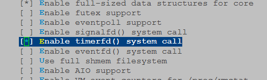
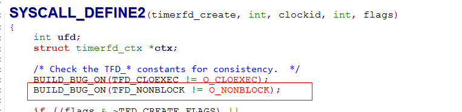

#### timerfd_create  "Function not implemented"问题  
@(工作笔记)[工作笔记]  
  
>在本地调好的程序，交叉编译正常，tftp进板子，发现运行不正常，调用这个函数时提示函数未实现。。  
  
能编译通过，说明C库支持这个函数，应该是内核不支持，查看了下内核版本，是大于支持该函数的版本的。还在内核代码里搜了下这个函数，找到了相应文件，应该是内核没有编译这个，需要重新配置内核。  
  
`make menuconfig`重新配置内核打开对应选项再编译即可  
  
  
然后搞了通，再编译跑起来，发现不提示"Function not implemented"了，但是提示参数不合法。看了下调用的地方，很标准写的`timerfd_create(CLOCK_MONOTONIC, TFD_NONBLOCK);`  
  
看了下这两个宏，在C库头文件和内核里面判断不一样  
  
  
把调用timerfd_create的参数改下就可以了，改`TFD_NONBLOCK`为`O_NONBLOCK`  
  
