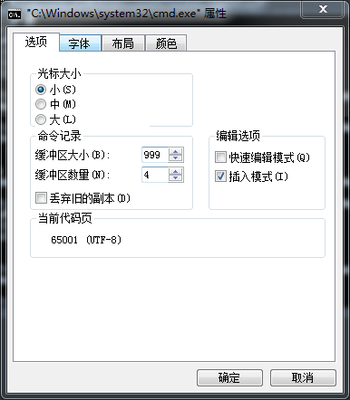
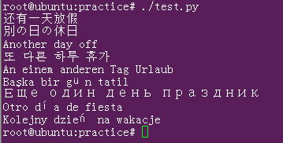

# python3 windows console 输出乱码问题  

> **问题**  

> 在python里面print韩文时，控制台报如下错误：  
>`UnicodeEncodeError: 'gbk' codec can't encode character '\uc7a5' in position 0: illegal multibyte sequence`  
>  


## 字符的编码  

* ASSIC  
计算机是美国发明的，他们不需要使用很多字符，一个字节能够表示256个字符就够用了，这就是最初的ASSIC编码，一个字节表示一个字符。  

* 中文编码  
到了中国汉字太多，一个字节表示不了，扩展为两个字节表示。怎么识别是否是汉字开始呢，就是字节编码大于127了，就认为是汉字开始。所以GBK下一个英文占一个字符，一个汉字占两个字符（source insight下对中文支持就不好，删除时按字节删除，删一个汉字要按两次退格键 -_-!）。  
GB2312 >>> GBK >>> GB18030，这是一个发展过程，GB18030是对中文支持最全的编码。  

* UCS-2(unicode)  
每个国家都用自己的编码方式显然很乱，于是出了unicode万国码，UCS-2一个字符占两个字节，2个字节最多表示65535个字符，把所有文字编进去我觉得很悬，所以还有UCS-4，一个字符占4个字节。  

* UTF-8  
UCS-2编码，一个字符总是占两个字节对于使用英文的人来说觉得太浪费。于是出了unicode的变长形式utf-8编码，一个英文字符占一个字节，但一个汉字要占3个字符。  

*一些网站为了提高网页访问速度节省带宽，中文网页使用gbk编码，英文网页使用utf-8编码*  

**编码转换**  
从上面对编码的介绍可以看出编码的转换只是特定编码（如GBK）和万国码（UCS-2，UTF-8）之间的转换。而不是说，我韩语的EUC-KR编码可以转为汉语GBK的编码。转换的过程如下：  
```
      查码表      标准规则
GBK    <--> unicode <--> utf-8
EUC-KR <--> unicode <--> utf-8
```
而且转码时你需要先知道输入的是什么编码才能正确查找对应码表转换。程序并不能精准的判断一个字符串是什么编码，只是可以猜测它是某种编码的概率是多少。  


## python文件的编码  
python是脚本语言，运行时才一条条解析命令，所以解析器解析脚本文件时需要指定一个编码方式。在python2.x里面解析器默认以ASSIC编码方式解析，所以当你的脚本中有中文时，就会报如下这种错  
```python
#!/usr/bin/python

# 哈哈哈
print("safaf发发")
```
```
SyntaxError: Non-ASCII character '\xe5' in file ./test.py on line 3, but no encoding declared; see http://www.python.org/peps/pep-0263.html for details
```
这个问题的解决很简单，就是在脚本开头指定解析本文件的编码方式就可以了，就像这样加一句`#coding=utf-8`。加这一句只是指定解析文件的编码，还有一个编码就是文件的保存编码。在linux上文件默认以UTF-8编码，所以显示没有问题，有的编辑器可能默认以GBK编码，那么输出又有问题。
```shell
iconv -f utf-8 -t gbk test.py -o test_gbk.py  #把文件编码转为gbk
chmod +x test_gbk.py #加可执行权限
./test_gbk.py #观察到输出乱码
```
所以`#coding=utf-8`这句是和文件保存的编码相对应的。  
在python3中，默认以utf-8解码脚本，为了兼容2.x，代码里面还是可以加上这句。**注意文件的保存也要使用utf-8编码方式保存**。  

## python字符串的编码和输出  

### 编码    
python3字符串的编码默认是unicode的。encode是把unicode字符串转为字节流，decode是把字节流转为unicode字符串。打印字节流看到是字符串的码值，而看不到字符串，就像这样。
```python
print('在佛山房'.encode('gbk'))
b'\xd4\xda\xb7\xf0\xc9\xbd\xb7\xbf'
```

### 终端输出  
　　最常见的输出是输出到控制台，这里面就包含一个过程。程序把一个字符串的字节序送到终端，终端收到这些字节后怎么处理，他怎么知道如何解码呢？终端也没那么聪明，就是用自己的默认编码来解码这些字节序。我们的终端默认是以GBK编码解码，所以把unicode编码的字符串转为GBK得到对应的GBK字符编码，然后查字体库，最后输出到终端。  
　　unicode是万国码包含所有语言的文字，而GBK只包含中文，unicode转GBK不一定总能成功。所以在打印韩语时会出现`UnicodeEncodeError: 'gbk' codec can't encode character '\uc7a5' in position 0: illegal multibyte sequence`的错。  
　　把终端的默认编码改为utf-8是不是就可以正常输出了呢？  
　　我们知道unicode和utf-8可以互转，按道理来说终端使用utf-8就可以打印所有语言的文字了。在windwos中设置console的默认编码为UTF-8执行`chcp 65001`即可，就可以在属性的选项看到当前代码页为UTF-8。  
　　  
但是win7韩语输出依然有问题，显示几行方框。显示方框是由于这个Lucida console字体里面没有韩文字，但明明只打印一行却显示几行应该是windows的输出bug。在win10上测试，则可以正常显示了（字体默认为新宋体）。  

## 怎么解决多国语言输出问题  
　　还是不要折腾windows终端的输出问题了（windows终端也真心难用）。linux下默认utf-8输出，虽然可以输出多语语言，但依然会遇到字体限制导致输出方框和字体美观的问题。  
　　*linux下新宋体字体的多国语言输出*  
　　  
　　不使用新宋体，一些字符会显示方框，但可以看到新宋体的输出很丑。  
　　**还是输出到文件把！**  

参考：  
http://www.cnblogs.com/feng18/p/5646925.html

