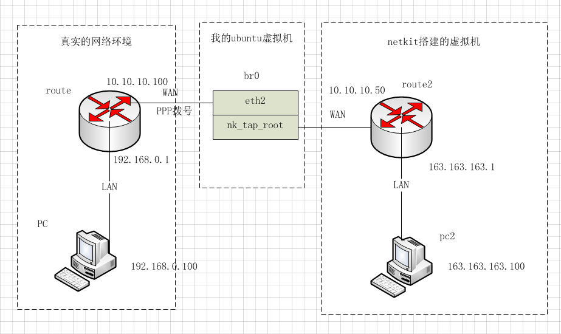
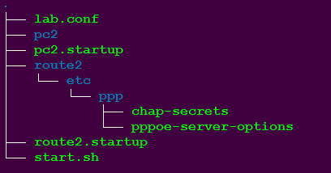
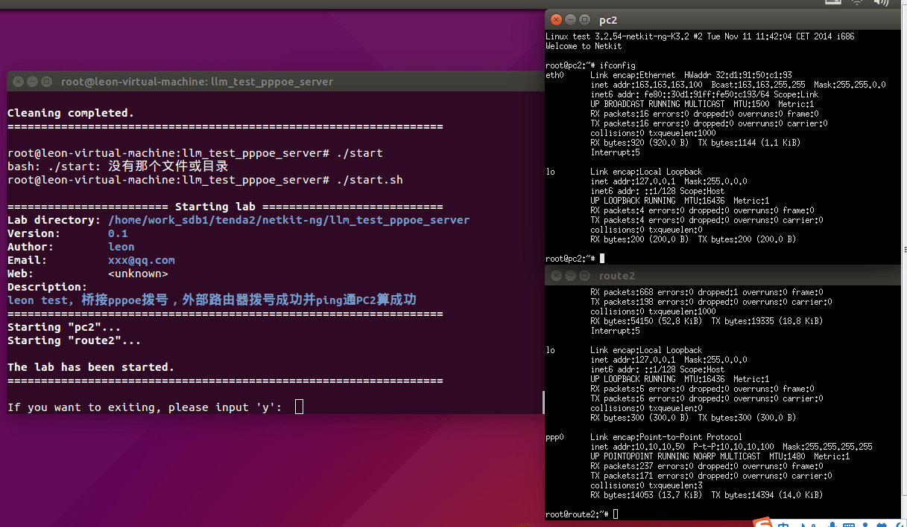
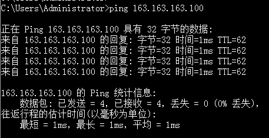

# 使用netkit搭pppoe服务器  
@(工作笔记)[工作笔记, netkit]  
  
　　关于netkit的使用前一遍文章已有说明，这一篇文章主要介绍另一种使用场景，netkit里面搭的虚拟网络拓扑怎么连接到真实的网络接口从而接入真实网络环境。    
  
## 网络拓扑图  
  
  
这里面主要的一点就是中间那块桥接网络，通过桥接实现物理接口和虚拟接口连接到一起。    
  
## netkit lab创建  
先看一下我的目录树：    
  
只有6个文件需要写入点内容，下面一一讲述。  
  
### lab.conf    
```  
LAB_DESCRIPTION="leon test, 桥接pppoe拨号，外部路由器拨号成功并ping通PC2算成功"  
LAB_VERSION="0.1"  
LAB_AUTHOR="leon"  
LAB_EMAIL="xxx@qq.com"  
  
route2[0]=A  
route2[1]=tap,0.0.0.0,0.0.0.0  
pc2[0]=A  
```  
描述网络拓扑环境，route2的eth1接口和tap口相连，不需要指定地址    
  
### pc2.startup  
```bash  
ifconfig eth0 163.163.163.100 up  
ip route add default via 163.163.163.1 dev eth0  
```  
只是配置接口IP地址并设置一条默认路由  
  
### route2.startup  
```bash  
ifconfig eth0 163.163.163.1 up  
ifconfig eth1 0.0.0.0 up  
  
# 创建ppp的字符设备，起pppd进程需要  
mknod /dev/ppp c 108 0  
  
# 拉起pppoe-server  
# -L:本地地址，-R:对端ppp接口的起始地址，-N:最多多少个人连  
pppoe-server -I eth1 -L 10.10.10.50 -R 10.10.10.100 -N 5  
```  
配置网络接口，拉起pppoe-server进程，pppoe-server需要配置，下面的文件会有  
  
### chap-secrets  
```  
# client    server  secret          IP addresses  
llm * llm *  
```  
配置pppoe拨号的用户名密码  
  
### pppoe-server-options  
```  
auth  
require-chap  
ms-dns 114.114.114.114  
ms-dns 5.5.5.5  
```  
auth需要认证，认证方式为chap，dns为下发的dns  
  
### start.sh    
```  
#!/bin/bash  
  
# 启动虚拟机  
lstart  
  
# 新建的桥名字  
BR=br0  
# 我的eth2接口为虚拟机的桥接模式网卡  
IF=eth2  
# 我的tap口名字  
TAP=nk_tap_root  
  
# 把tap口添加到桥下面()  
brctl addbr $BR  
brctl addif $BR $TAP   
brctl addif $BR $IF  
  
ifconfig $TAP up   
ifconfig $BR up  
  
while true  
do  
    # -p参数，提示信息。读取内存存到INPUT变量  
    read -p "If you want to exiting, please input 'y':  " INPUT  
  
    if [[ "$INPUT" = "y" ]]; then  
  
        brctl delif $BR $IF  
        brctl delif $BR $TAP  
        ifconfig $BR down  
        ifconfig $TAP down  
        brctl delbr $BR  
        lcrash  
        lclean  
        exit  
    fi  
done  
```  
这个脚本主要是控制创建桥，删除桥，启动就直接执行这个脚本。    
  
## 执行测试    
执行start.sh，就可以看到虚拟机一个个起来了，路由器可以正常拨号获取到IP和DNS。路由器下的PC（192.168.0.100）也可以正常ping通route2相连的pc2(163.163.163.100)。  
  
  
ping测试：  
  
