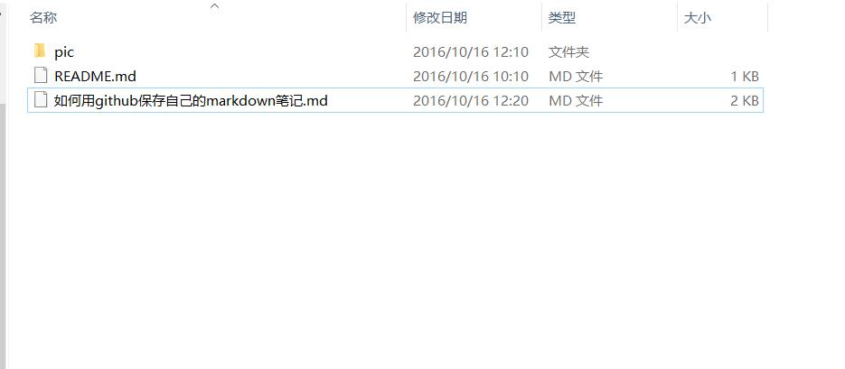

# 如何用github来保存自己的markdown笔记  

* 以往自己怎么保存markdown笔记的？  
用sublime text写好后，在浏览器预览了，保存md文件和浏览器的网页另存文件，给别人分享时直接发送网页文件。  
这样做就遇到一个**问题**：里面的图片用的相对路径，别人的电脑就都看不到图片了。  
为了解决这个问题，只能把图片保存到免费图床上，链接地址写网络地址。这样做就是有点操作太麻烦，贴一张图需要如下步骤：打开浏览器上传图片到图床(网络不通又郁闷了)，复制链接地址，粘贴到文本。  

***

>　　为了解决这个分享文档中图片的问题，就想到把图片保存github上。因为至少把图上传到github可以通过命令行搞定，操作快很多。实际上好处不止这一点。下面就介绍一下使用github舒服的写markdown笔记的过程。  
  

**准备工作**  
注册github账号和学习git的基本操作，推荐看这个[git教程](http://www.liaoxuefeng.com/wiki/0013739516305929606dd18361248578c67b8067c8c017b000)就可以了。  

**步骤**  
1. 在github上建立一个项目用来存放我们的笔记  
2. 把自己电脑的ssh公钥添加到这个项目设置里，以便电脑端通过git提交到github  
3. 电脑把这个项目clone下来  
`git clone git@github.com:leon0625/blog.git`  
4. 在这个目录自己写markdown的笔记，图片也保存到这个目录或子目录下，markdown里的图片地址写相对路径即可  
5. 写完了通过sublime插件预览一下效果对不对，然后提交到github    
`git add ./`  
`git commit -m "添加如何用github保存自己的markdown笔记笔记"`  
`git push origin master`  
6. 把github的地址发给大家，大家就可以看到你分享的笔记了   
7. 其他电脑笔记同步      
`git pull origin master`  

***

## 总结  
**优点：**
* 编写和添加图片的过程是可以离线的
* 本地预览和其他电脑预览到的效果一致  
* 多台电脑同步笔记很方便  
* git的使用，方便查看修改日志和回退版本  

**缺点：**  
* github里的所有笔记别人都是可以看到的  

这是图片添加例子  

　　
