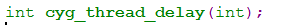

# 小心编译器的隐式声明  

>引子:  
　　在一个ecos项目中出现一个奇怪的问题，内核标准线程休眠函数`cyg_thread_delay()`在有的地方可以正常执行休眠，有的地方则一休眠不再醒过来。  

## 问题跟踪  
在cli线程里加入调试命令，测试该函数，代码如下：  
```c
static void sleep(int argc, char *argv)
{
    printf("-------------\n");
    cyg_thread_delay(100);  //休眠1秒
    printf("-------------\n");
}
CLI_NODE("sleep", sleep, "sleep test");
```
发现一执行命令，只能打印第一句printf，然后cli线程卡住无响应，线程状态为sleep状态。在内核对`cyg_thead_delay`的实现部位加了打印入参语句，发现入参是很大一个值。这就奇怪了，我不传的100进去吗？  
  
后面偶然发现加入声明这个函数的头文件`<cyg/kernel/kapi.h>`就一切正常了，这是为什么呢，之前没声明不也编过了吗？  

## 根因  
这都是**编译器隐式声明的陷阱**，首先函数没声明的时候编译器会隐式声明并报警告（得开-Wall）  
  

* 隐式声明的规则为：**隐式声明的函数返回值都为int，参数类型则会根据你的入参来决定**。  

在上面的例子中，我们传入的参数为100, 100的字面类型应该为int（或者一个更小的类型），即编译器在编译时加入了这么一句话来声明这个函数：  
  
但这个函数的实际声明是这样的：  
  
*这两个声明返回值类型和入参类型都不一致，风险很大*  
  
`cyg_tick_count_t`定义为64位的unsigned long long型，即当声明参数为32位的int时，调用这个函数时就只使用一个寄存器写入100，传过去，但到函数体哪儿是64位的，会读两个寄存器，那么就会有一个寄存器的值不确定，组合起来往往为很大的一个数，所以一直休眠……  
  
如果把代码改成这样，就能顺畅运行，也佐证了上面的论述  
  

**其他注意点**:
上面是一个由于函数声明的入参类型不匹配导致的一个奇怪bug，还容易出现的一个bug为返回值类型不匹配。在一个大工程里面这些BUG发生后会使DEBUG人员感到十分困惑，不容易调查。  

## 如何避免  
四个字：**编程规范**，使用函数时记得要先声明。  
  
知易行难，自己写一个文件时，包含各种头文件，函数声明我们一般不会少。但在改代码时就往往很难做到了，我们在修改一行代码时会先检查自己要调用的函数有声明吗？（其实检查也不是那么容易，因为在大工程里头文件包含层级关系比较复杂，当然我们也可以不检查，重复include也没关系，但有时我们甚至都不知道调用这个函数要include哪个头文件）所以一般就是改完，发现能编译过就皆大欢喜了。  
  
**还有其他的办法吗？**  
在引子里提到的问题，需要查找所有调用`cyg_thread_delay`函数的文件，在文件中加include语句吗？这样是可行的，但修改点可能较多。我是通过修改makefile来实现的，在顶层makefile的CFLAGS里加了-include选项`CFLAGS += -include cyg/kernel/kapi.h`，这句话的作用就相当于为每一个需要编译的c文件都加了`#include <cyg/kernel/kapi.h>`语句。  
  
使用GCC的-include属性可以避免一些头文件包含的问题，缺点在于改了-include的这个头文件所有C文件都需要重新编译，耗时长  

