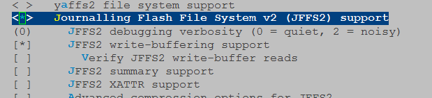

### 挂载jffs2文件系统遇到的问题  
@(工作笔记)[工作笔记]  
  
>在板子里面使用如下命令`mount -t jffs2 /dev/mtdblock7 /var/dr_bin/`挂载文件系统时遇到几个问题，如下：  
  
#### 提示No such device问题  
报错提示如下：  
```  
mount: mounting /dev/mtdblock7 on /var/dr_bin/ failed: No such device  
```  
这个是**由于系统不支持jffs2文件系统导致**，可以通过`cat /proc/filesystems `命令查看内核支持哪些文件系统  
```  
~ # cat /proc/filesystems  
nodev   sysfs  
nodev   rootfs  
nodev   bdev  
nodev   proc  
nodev   tmpfs  
nodev   sockfs  
nodev   pipefs  
nodev   anon_inodefs  
nodev   devpts  
        squashfs  
nodev   ramfs  
nodev   mtd_inodefs  
```  
**解决办法**  
打开内核的JFFS2选项，重新编译内核，选项位置为 File systems  ---> Miscellaneous filesystems  --->Journalling Flash File System v2 (JFFS2) support  
  
  
#### 提示擦除块相关错误的  
经过上一步之后还是遇到点问题，错误可能如下：  
```  
~ # mount -t jffs2 /dev/mtdblock7 /var/dr_bin/  
jffs2: Too few erase blocks (1)  
mount: mounting /dev/mtdblock7 on /var/dr_bin/ failed: Invalid argument  
```  
也可能如下：  
```  
/var # mount -t jffs2 /dev/mtdblock5 /var/dr_bin/  
jffs2: jffs2_scan_eraseblock(): Magic bitmask 0x1985 not found at 0x00000000: 0xe58c instead  
...  
jffs2: jffs2_scan_eraseblock(): Magic bitmask 0x1985 not found at  
jffs2: Further such events for this erase block will not be printed  
jffs2: Cowardly refusing to erase blocks on filesystem with no valid JFFS2 nodes  
jffs2: empty_blocks 6, bad_blocks 0, c->nr_blocks 8  
mount: mounting /dev/mtdblock5 on /var/dr_bin/ failed: Input/output error  
```  
这是**由于该分区块上以前有残留数据**，不是全0xFF导致，需要手动擦除该块。  
**解决办法**  
dd命令生成一个全FF的文件，大小和分区大小一致，然后tftp到板子，再cat这个文件重定向到该分区即可。例如（cat 512KFF > /dev/mtdblock5）  
