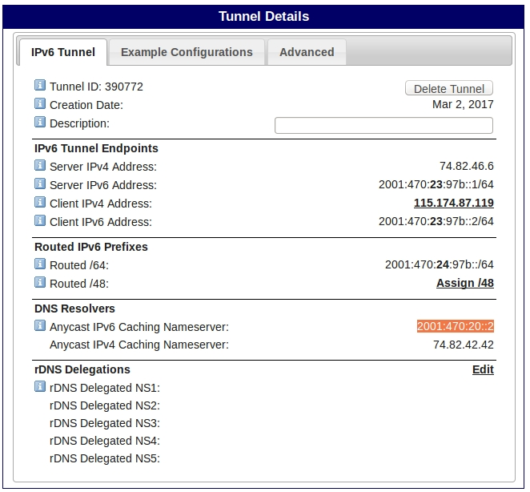

# 访问一下互联网中的IPV6主机  

>　　利用隧道代理实现互联网中访问IPv6主机  

* 在https://tunnelbroker.net/ 注册账号  

* 在tunnelbroke创建一条隧道（首先确保你的IP是公网IP并可以ping通），然后你会得到隧道两端如下的配置  
  

* 可以点击Example Configurations看如何配置，下面是我自己配置ubuntu主机的方法  
```
ip tunnel add tun01 mode sit remote 74.82.46.6 local 115.174.87.119
ip link set tun01 up
ip -6 addr add 2001:470:23:97b::2/64 dev tun01
ip -6 route add default via 2001:470:23:97b::1 
``` 

* 测试一下能不能ping通默认路由  
`ping6  2001:470:23:97b::1`  

* 这时我就去打开 http://www.kame.net/ ,发现还是一只静态的海龟。估计是DNS解析的问题，于是手动解析吧  

* 执行命令`host www.kame.net`解析到IPV6地址  
```
root@ubuntu15:leon# host www.kame.net
www.kame.net is an alias for orange.kame.net.
orange.kame.net has address 203.178.141.194
orange.kame.net has IPv6 address 2001:200:dff:fff1:216:3eff:feb1:44d7
```  

* 浏览器输入[2001:200:dff:fff1:216:3eff:feb1:44d7] 访问，成功看到一只会动的小海龟  
  

参考：  
http://www.ibm.com/developerworks/cn/linux/l-cn-ipv6/  
